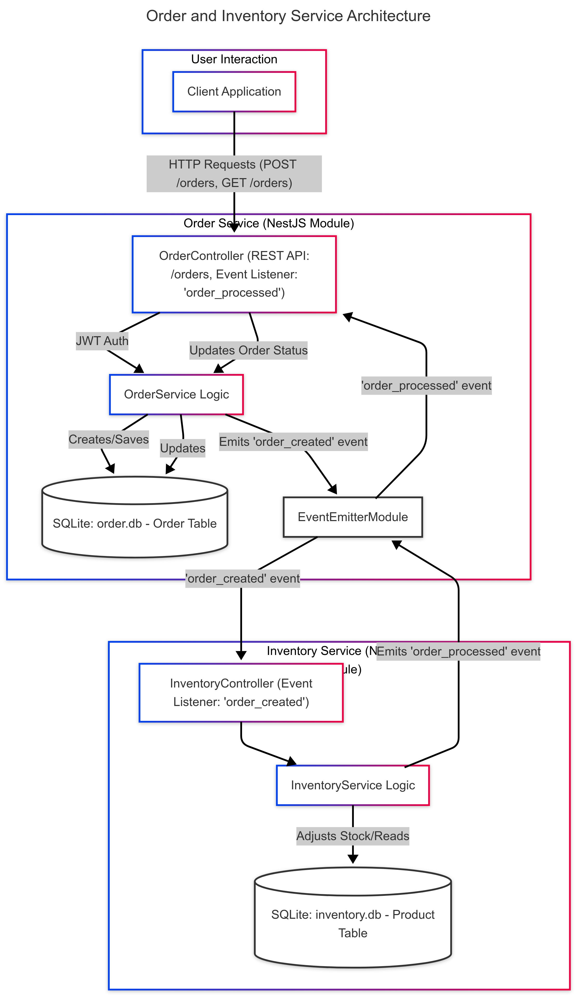

# Order & Inventory Microservices Simulation

## Introduction

This project simulates a microservices architecture with two distinct services: an Order Service and an Inventory Service, operating within a single NestJS application. The services communicate asynchronously using NestJS's built-in `EventEmitterModule` to mimic message passing in a distributed system.

The primary goals of this project are:

- To demonstrate inter-service communication via events.
- To implement JWT-based authentication for securing endpoints.
- To showcase a minimal setup using SQLite for persistence and Docker for containerization.

## Setup Process

You can run this project either locally using Node.js and npm, or using Docker.

### Local Setup

1.  **Prerequisites:**
    - Node.js (version compatible with NestJS 11, e.g., >= 16.x)
    - npm (version compatible with NestJS 11, e.g., >= 8.x)
2.  **Clone the repository (if applicable):**
    ```bash
    git clone https://github.com/mabubakr1113/order-inventory
    cd order-inventory
    ```
3.  **Install dependencies:**
    ```bash
    npm install
    ```
    This command installs all the necessary dependencies listed in the `package.json` file.
4.  **Run the application in development mode:**
    ```bash
    npm run start:dev
    ```
    The application will typically be available at `http://localhost:3000`.

### Docker Setup

1.  **Prerequisites:**
    - Docker
    - Docker Compose
2.  **Build and run the application using Docker Compose:**
    `bash
    docker-compose up --build
    `
    The application will be accessible at `http://localhost:3000`.

## File Structure

Here's a brief overview of the key files and directories:

```
.
├── db/                       # SQLite database files will be stored here (created on run)
├── dist/                     # Compiled JavaScript files (after build)
├── node_modules/             # Project dependencies
├── src/
│   ├── app.module.ts         # Root module of the application
│   ├── main.ts               # Application entry point
│   ├── auth/                 # Authentication module (JWT strategy)
│   │   ├── auth.module.ts
│   │   └── jwt.strategy.ts   # JWT validation logic
│   ├── inventory/            # Inventory service module
│   │   ├── dto/
│   │   │   └── inventory-order-created.dto.ts
│   │   ├── entities/
│   │   │   └── product.entity.ts
│   │   ├── inventory.controller.ts # Handles inventory-related requests and events
│   │   ├── inventory.module.ts
│   │   └── inventory.service.ts    # Business logic for inventory management and event handling
│   └── order/                # Order service module
│       ├── dto/
│       │   └── create-order.dto.ts
│       ├── entities/
│       │   └── order.entity.ts
│       ├── order.controller.ts   # Handles order creation, listing, and events
│       ├── order.module.ts
│       └── order.service.ts      # Business logic for order management and event handling
├── .env.example              # Example environment variables (if any, though JWT_SECRET is in docker-compose)
├── .eslintrc.js              # ESLint configuration
├── .prettierrc               # Prettier configuration
├── docker-compose.yml        # Docker Compose configuration for services
├── Dockerfile                # Instructions to build the Docker image
├── nest-cli.json             # NestJS CLI configuration
├── package.json              # Project metadata and dependencies
├── tsconfig.build.json       # TypeScript configuration for building
└── tsconfig.json             # Base TypeScript configuration
```

## System Diagram



## Event Flow Explanation

1.  **Place Order:** A client sends an HTTP POST request to the `/orders` endpoint of the Order Service to place a new order. This request must include a valid JWT token in the Authorization header.
2.  **Order Creation (`order_created` event):**
    - The `OrderController` receives the request.
    - The `OrderService` validates the request, creates a new order entry in the `order.db` SQLite database, and saves it.
    - Upon successful creation, the `OrderService` emits an `order_created` event using the `EventEmitterModule`, with the order details as the payload.
3.  **Inventory Processing (`order_created` listener & `order_processed` event):**
    - The `InventoryController` in the Inventory Service listens for the `order_created` event.
    - When an `order_created` event is received, the `InventoryService` is triggered.
    - The `InventoryService` checks if the product is available and if there's sufficient stock in its `inventory.db`.
      - If stock is sufficient, it deducts the ordered quantity from the product's stock and saves the update. The status is marked as 'confirmed'.
      - If stock is insufficient or the product doesn't exist, the status is marked as 'cancelled'.
    - The `InventoryService` then emits an `order_processed` event with the `orderId` and the final `status` (e.g., 'confirmed' or 'cancelled').
4.  **Order Status Update (`order_processed` listener):**
    - The `OrderController` in the Order Service listens for the `order_processed` event.
    - When an `order_processed` event is received, the `OrderService` is triggered.
    - The `OrderService` updates the status of the corresponding order in the `order.db` with the status received from the Inventory Service.

## Decisions Made Under Time Constraints

Given the nature of a take-home task with a focus on demonstrating core concepts with minimal setup, the following decisions were made:

- **Single Repository:** Both services (Order and Inventory) are implemented within the same NestJS project and repository for simplicity, rather than as separate deployable microservices.
- **In-Memory Event Bus:** NestJS's `EventEmitterModule` is used for asynchronous communication between services. This simulates a message bus (like RabbitMQ or Kafka) without the overhead of setting up external broker services.
- **SQLite Database:** SQLite is used as the database for both services. It's file-based and requires no separate database server installation, making setup quick and easy. Data is persisted in the `./db` directory.
- **Simplified Error Handling & No Saga/Rollbacks:** For brevity, complex error handling, distributed transaction management (like Sagas for rollbacks in case of inventory stock failure after order creation), and extensive input validation beyond basic DTO validation are not implemented.
- **Basic JWT Setup:** A simple JWT strategy is implemented for the Order Service. It relies on a configurable secret and expiration. User management (registration, login to obtain JWTs) is not part of this simulation; it's assumed the client already has a valid JWT.
- **Seed Data:** The Inventory Service seeds initial product data on module initialization for demonstration purposes.

## Generating a JWT Token for Testing

The Order Service endpoints (`/orders`) are protected using JWT authentication. To interact with these endpoints, you'll need to provide a valid JWT token in the `Authorization` header as a Bearer token.

You can generate a token using a tool like [jwt.io](https://jwt.io/). Here's how:

1.  **Algorithm:**
    Ensure the algorithm selected on jwt.io is `HS256`.

2.  **Payload:**
    A sample payload would be:

    ```json
    {
      "sub": "someUserId",
      "username": "testuser"
    }
    ```

3.  **Secret:**
    The secret key used to sign and verify the token, As defined in .env or docker:

    **Secret Key:** `a-string-secret-at-least-256-bits-long`

4.  **Generate and Use:**
    Once you've set the algorithm, payload, and secret on jwt.io, the site will provide you with the encoded JWT. Copy this token.

    When making requests to protected endpoints (e.g., using Postman or curl), include it in the `Authorization` header:

    ```
    Authorization: Bearer <your_generated_jwt_token>
    ```

---
